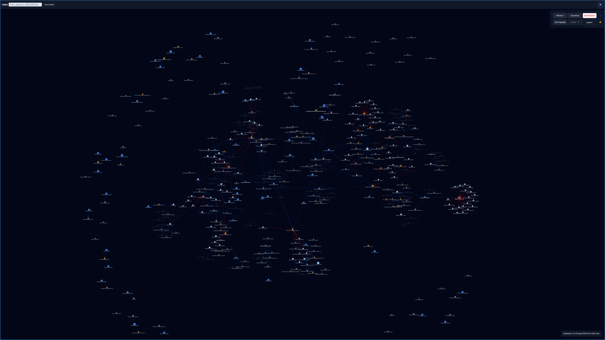

# FINRA Network Graph

An interactive FINRA / SEC relationship explorer built with **Next.js 15**, **React 19**, and **D3 v7**.

The app turns FINRA BrokerCheck and SEC AdviserInfo records into a navigable network of people, firms, and control relationships. You can search, expand the graph incrementally, inspect merged detail records, and keep your working session across reloads.

Live demo: https://finra-data-chart-next-02.vercel.app

---

## At a glance

- Explore relationships between brokers, advisers, firms, and control entities
- View FINRA BrokerCheck and SEC AdviserInfo detail in one place
- Expand the graph incrementally from searches, fetched records, and saved profiles
- Inspect rich sidebar detail with timelines, disclosures, and ownership context
- Run locally from cached artifacts or deploy with bundled graph and primed cache data

---

## Preview & demo



- **Live app:** https://finra-data-chart-next-02.vercel.app
- **Best first click:** search a person, firm, or CRD, then open a node and explore the sidebar detail sections

---

## Why this exists

FINRA and SEC data is rich, but it is usually consumed one record at a time.

This project turns those record-by-record views into a navigable network so you can:

- spot clusters of related firms and people faster
- inspect ownership and control relationships alongside employment history
- compare FINRA and SEC detail in one place
- preserve a working graph session while investigating a specific part of the network

It is especially useful when you want to move from “look up one record” to “understand the surrounding ecosystem.”

---

## What the app does

- Maps relationships between **individuals**, **firms**, and **non-CRD entities** in a force-directed graph
- Blends **FINRA BrokerCheck** and **SEC AdviserInfo / IAPD** data into a single interactive view
- Lets you open a detail sidebar for merged records, employment history, registrations, disclosures, and control relationships
- Grows the graph incrementally as you search, fetch, and expand records
- Saves your working session in the browser so selections, highlights, added nodes, and layout state survive reloads

---

## Current UI highlights

The current interface is built around a mobile-first floating menu and detail sidebar:

- **Fetch Nodes** search for people, firms, CRDs, and IDs
- A first-visit onboarding overlay that highlights the search field when the graph is empty
- A short-lived mobile status message below the search input after successful fetches
- Quick graph actions for **Reflow Layout**, **Clear Highlight**, and **Reset Session**
- An animated hamburger menu with a persistent pin control beside it
- A detail sidebar with:
  - **Center** and **Close** actions
  - mobile **Info** and **Log** toggles for the selected node
  - a mobile **Legend** tooltip that can expand outside the menu container
  - sticky section headers for long detail views
- Automatic sidebar restore when a saved session includes a selected node
- A neutral hint state when the graph is empty, so stale person or firm detail is never left on screen
- Background click and `Escape` support for dismissing the sidebar when it is not pinned

---

## Quick start

### Install and run locally

```bash
pnpm install
pnpm run dev:clean
```

Local app URL:

- `http://localhost:4444`

`dev:clean` is the safest option when the local `.next` cache gets grumpy.

### Useful local commands

```bash
# Standard dev server
pnpm run dev

# Iteratively expand the local FINRA/SEC cache from identifiers already discovered
pnpm run prime:all

# Rebuild graph artifacts from cached JSON on disk
pnpm run build:graph

# Production build (also regenerates graph artifacts first)
pnpm run build
```

### Production build note

On large graph snapshots, `next build` may need more Node heap during trace collection.

This command has been verified to complete successfully in this repo:

```bash
env NODE_OPTIONS=--max-old-space-size=8192 pnpm build
```

---

## Environment variables

| Variable                                              | Purpose                                                                                         |
| ----------------------------------------------------- | ----------------------------------------------------------------------------------------------- |
| `NEXT_PUBLIC_API_URL`                                 | Optional API base URL for client-side requests; leave unset for relative `/api/...` calls       |
| `NEXT_PUBLIC_ENABLE_SERVER_PROFILE_SYNC`              | When set to `1`, fetched node selections can be synced into the server-side `custom` profile    |
| `UPSTASH_REDIS_REST_URL` / `UPSTASH_REDIS_REST_TOKEN` | Enables shared Redis-backed graph, seed bank, recent-seed tracking, and response caching        |
| `CRON_SECRET`                                         | Optional bearer token required by `/api/finra/prime-check` when you want to protect cron access |
| `FINRA_PRIME_BATCH_LIMIT`                             | Optional limit override for the prime-check warming batch                                       |
| `FINRA_PRIME_CONCURRENCY`                             | Optional concurrency override for the prime-check warming batch                                 |

If Redis is **not** configured, the app falls back to:

- filesystem-backed graph / seed storage
- in-memory request caching for upstream API responses

---

## Data sources

The application uses detail-first upstream endpoints for canonical person and firm records:

| Source                                                          | Purpose                 |
| --------------------------------------------------------------- | ----------------------- |
| `https://api.brokercheck.finra.org/search/individual/<CRD>?...` | FINRA individual detail |
| `https://api.brokercheck.finra.org/search/firm/<CRD>?...`       | FINRA firm detail       |
| `https://api.adviserinfo.sec.gov/search/individual/<CRD>?...`   | SEC individual detail   |
| `https://api.adviserinfo.sec.gov/search/firm/<CRD>?wt=json`     | SEC firm detail         |

The app also proxies FINRA / SEC search-style endpoints for user-driven lookup flows.

---

## Runtime data model

### Main graph artifacts

The build/runtime pipeline centers on these generated files:

- `data/national/finra-graph.json` — graph nodes, links, and meta
- `data/national/finra-seed-bank.json` — deduplicated IDs/counts used for global stats and lookup support
- `data/national/primed-cache/*.json` — bundled FINRA / SEC response caches for deployment-time warm starts

### Seed inputs

- `data/seed-profiles.json` stores named profiles and curated IDs/seeds
- `/api/finra/seeds` can return either base seeds or seed-bank data (`?bank=1`)
- the app also tracks **recently viewed individual and firm IDs** so production prime-check runs can warm likely hot paths

---

## Caching and storage behavior

### Graph storage

- **Local development**: graph and seed-bank data are read from disk
- **With Upstash Redis**: graph and seed-bank data are served from Redis when present
- If Redis is enabled but the graph key is empty, the server will **bootstrap the graph from the bundled disk graph artifact** and store it back into Redis

### Upstream response caching

The FINRA / SEC proxy layer uses `cachedFetch` with:

- Redis when available
- in-memory fallback locally
- a pre-primed bundle fallback from `data/national/primed-cache/` before calling live upstream APIs

This means deployed cold starts can often hydrate API responses from shipped cache bundles without immediately hitting upstream services.

### Session persistence

The browser stores graph session state in `localStorage`, including:

- selected node
- highlight roots / hop settings
- positions for rendered nodes
- extra nodes and links injected beyond the original server response
- zoom transform

---

## Graph semantics

### Node types

- **Individual** — person / broker / adviser representative
- **Firm** — broker-dealer or adviser firm
- **Entity** — non-individual owner from Form BD data

### Relationship types

- `employed_by`
- `previous_employed_by`
- `controls`

The graph and loader code normalize `relationship` as the canonical link field, even when older payloads still contain legacy `type` values.

### Disclosure indicator

People and firms with disclosures render with an additional disclosure ring so regulatory history is visible directly on the graph.

---

## Detail sidebar behavior

Person and firm detail rendering currently supports:

- merged FINRA + SEC detail routes
- normalized label/location formatting
- sorted dated cards with current/newest items first where applicable
- sticky main section titles in the scrolling detail panel
- disclosures with richer field extraction and presentation
- mobile-first sidebar interactions including:
  - temporary pinning while expanded **Info** / **Log** panels are open
  - persistent menu pinning from the header control
  - empty/hint fallback content when no node detail should be shown

For individuals, the sidebar can include:

- aliases
- years of experience / firm counts
- current and previous employment
- current and previous registrations
- registered SROs and states
- control positions
- qualifications & exams
- disclosures

For firms, the sidebar can include:

- contact and registration info
- general information
- Form ADV brochures
- disclosures
- direct owners / executive officers

---

## Architecture overview

```text
data/
  seed-profiles.json
  national/
    finra-graph.json
    finra-seed-bank.json
    primed-cache/
  external/

scripts/
  build_graph_from_cache.js
  build_primed_cache_bundle.js
  download_all_api_data.js
  parallel_crawler.js
  batch_crawl_and_build.js
  continuous_crawl_and_rebuild.js
  recompute_graph_meta.js
  check_local_integrity.js
  enrich_nodes.js

src/
  app/
    page.tsx
    api/finra/**
  components/
    FinraGraph.tsx
  lib/
    finra-graph.ts
    finra-graph/
      detailUtils.ts
      formatters.ts
      sidebar.ts
    graphStore.ts
    cache.ts
```

---

## Key scripts

### Build graph artifacts from cached JSON

```bash
node scripts/build_graph_from_cache.js --employment-scope all --no-redis
```

What it does:

- reads cached FINRA / SEC payloads from disk
- rebuilds graph nodes and links
- writes `finra-graph.json`
- writes `finra-seed-bank.json`
- optionally syncs the graph and seed bank to Redis

Supported employment scopes:

- `current`
- `previous`
- `all`
- `none`

### Build deployment cache bundles

```bash
node scripts/build_primed_cache_bundle.js
```

This creates merged JSON bundles in `data/national/primed-cache/` from canonical cached filenames such as:

- `api.brokercheck.finra.org_search_individual_<CRD>.json`
- `api.adviserinfo.sec.gov_search_individual_<CRD>.json`
- `api.brokercheck.finra.org_search_firm_<CRD>.json`
- `api.adviserinfo.sec.gov_search_firm_<CRD>.json`

### Iterative priming / expansion

```bash
node scripts/download_all_api_data.js
```

This script:

- rebuilds the graph first
- runs the crawler in batches
- rebuilds the graph after each batch
- can optionally bootstrap from a remote seed graph via `--seed-graph-url`

### Other maintenance scripts

```bash
node scripts/batch_crawl_and_build.js
node scripts/continuous_crawl_and_rebuild.js
node scripts/recompute_graph_meta.js
node scripts/check_local_integrity.js
node scripts/enrich_nodes.js
```

---

## API surface

### Graph and state routes

| Route                            | Purpose                                                                                |
| -------------------------------- | -------------------------------------------------------------------------------------- |
| `GET /api/finra/graph`           | Return the full graph or a random seeded subset with 3-hop context when `limit` is set |
| `POST /api/finra/graph-append`   | Persist newly fetched nodes/links into the graph store                                 |
| `POST /api/finra/graph-reset`    | Clear the persisted graph/session-backed store                                         |
| `GET /api/finra/graph-search`    | Search the local graph store                                                           |
| `GET /api/finra/nodes-by-ids`    | Return graph nodes by ID                                                               |
| `GET /api/finra/expand/[nodeId]` | Return N-hop neighborhood expansion for a node                                         |

### Detail and merge routes

| Route                                    | Purpose                                       |
| ---------------------------------------- | --------------------------------------------- |
| `GET /api/finra/individual/[crd]`        | FINRA / SEC-backed individual detail          |
| `GET /api/finra/firm/[id]`               | FINRA / SEC-backed firm detail                |
| `GET /api/finra/merged/individual/[crd]` | Explicit merged FINRA + SEC individual record |
| `GET /api/finra/merged/firm/[id]`        | Explicit merged firm record                   |

### Search and helper routes

| Route                            | Purpose                                                               |
| -------------------------------- | --------------------------------------------------------------------- |
| `GET /api/finra/search`          | FINRA search proxy                                                    |
| `GET /api/finra/sec-search`      | SEC individual search proxy                                           |
| `GET /api/finra/sec-search-firm` | SEC firm search proxy                                                 |
| `GET /api/finra/location-search` | FINRA location-oriented search proxy                                  |
| `GET /api/finra/cache-stats`     | Return deduplicated global counts from the seed bank plus link totals |
| `GET /api/finra/health`          | Lightweight health/status check                                       |
| `POST /api/finra/recompute-meta` | Recompute graph meta counts from stored graph data                    |
| `GET /api/finra/run-scraper`     | SSE stream for scraper execution logs                                 |
| `GET /api/finra/prime-check`     | Daily production warm-up route                                        |

### Seed / profile routes

| Route                            | Purpose                                           |
| -------------------------------- | ------------------------------------------------- |
| `GET /api/finra/seeds`           | Return current seed list or public seed-bank data |
| `PUT /api/finra/seeds`           | Replace stored seeds                              |
| `GET /api/finra/profile/[name]`  | Load a named profile                              |
| `POST /api/finra/add-to-profile` | Append individuals/firms into a named profile     |

---

## Deployment notes

### Vercel

- `vercel.json` schedules **one daily cron**:
  - `GET /api/finra/prime-check` at `0 3 * * *`
- API routes under `src/app/api/**` are configured with `maxDuration: 30`

### Runtime bundle contents

`next.config.ts` includes these files in traced output:

- `data/national/**/*.json`
- `data/seed-profiles.json`

That ensures deployment bundles contain:

- the graph artifact
- the seed bank
- primed cache bundles
- profile definitions

### `.vercelignore`

Deployment intentionally excludes:

- `data/external/`
- loose raw cache mirrors under:
  - `data/national/adviserinfo.sec.gov/`
  - `data/national/brokercheck.finra.org/`

This keeps the deployment payload smaller while still shipping the consolidated graph and primed-cache artifacts the app actually uses at runtime.

---

## Recommended workflows

### Local development

1. `pnpm install`
2. `pnpm run dev:clean`
3. Optionally expand the local cache with `pnpm run prime:all`
4. Rebuild graph artifacts with `pnpm run build:graph`

### Preparing a deployment

1. Refresh cached data / graph artifacts locally
2. Ensure `data/national/finra-graph.json` and `data/national/finra-seed-bank.json` are current
3. Ensure `data/national/primed-cache/` is regenerated
4. Build with:

```bash
env NODE_OPTIONS=--max-old-space-size=8192 pnpm build
```

---

## Notes

- The graph UI is intentionally optimized for incremental growth rather than a single massive one-shot render.
- Global People / Firms counts shown by the app come from the **seed bank**, not just the currently rendered subset.
- The prime-check route warms recent usage paths; it is **not** a continuous crawler.
